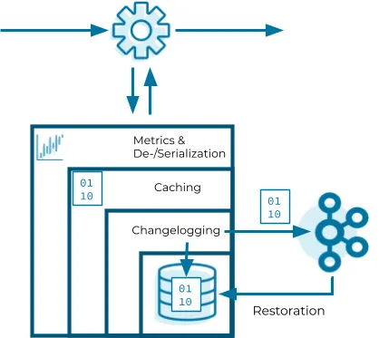

# Balance

## State Store

- It is a key-value store.
- Data in the state store is persisted into RocksDB which is the default storage and the data is also cached in memory for performance boost.
- Apart from storing into RocksDB on local disk, the same data is published to a Kafka `changelog` topic for the data recovery in the topology is restarted.

## Setup
```shell
make setup-dev
```

## CURL

### Create Balance

```shell
curl --location --request POST 'localhost:8000/api/balance/create'
```

### List Balances

```shell
curl --location --request GET 'localhost:8000/api/balance'
```

### Get balance by Id

```shell
curl --location 'http://localhost:8000/api/balance/01548036-2a69-43f3-b488-9e9331a40b8e'
```

### Deposit
```shell
curl --location 'localhost:8000/api/balance/deposit' \
--header 'Content-Type: application/json' \
--data '{
    "balanceId": "ecd18ff0-2560-4908-9eed-ab371b5289d1",
    "amount": 1
}'
```

### Withdraw
```shell
curl --location 'localhost:8000/api/balance/withdraw' \
--header 'Content-Type: application/json' \
--data '{
    "balanceId": "ecd18ff0-2560-4908-9eed-ab371b5289d1",
    "amount": 1
}'
```
